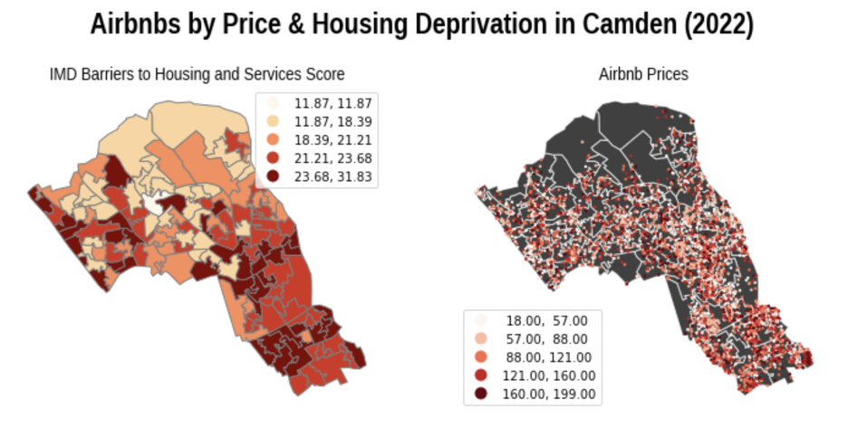
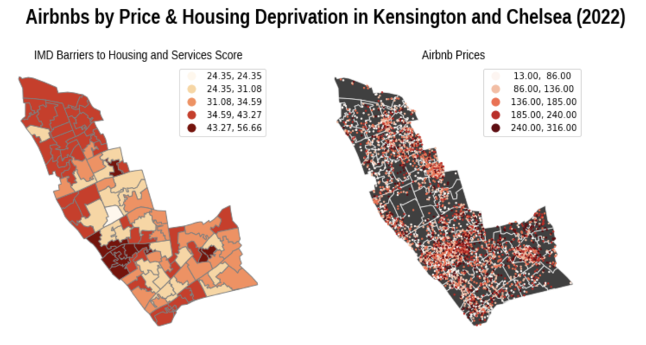
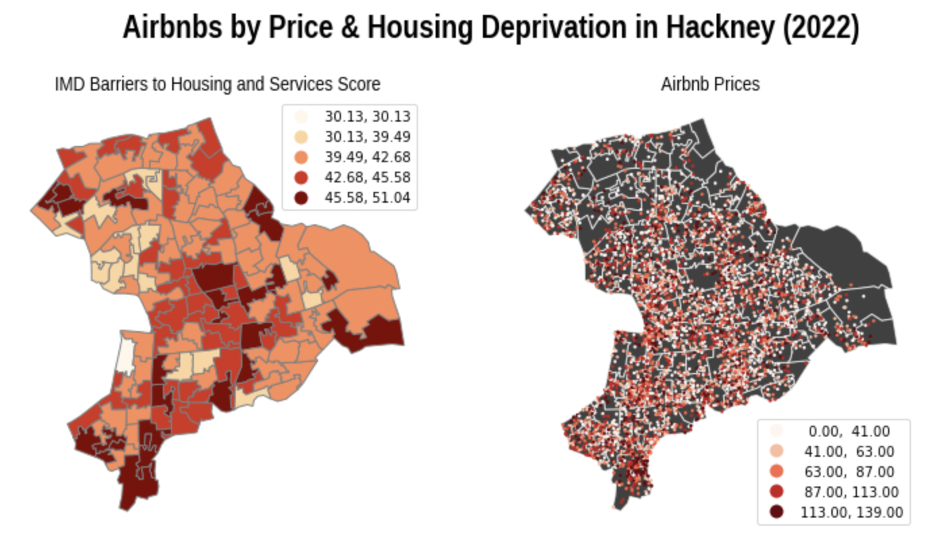

We, [Jessica Sumner, Diego Soler, Matthew Martignoni, and Phil], confirm that the work presented in this assessment is our own. Where information has been derived from other sources, we confirm that this has been indicated in the work.

[]

Date: 16 January 2023

Student Numbers: 22227558

## Intro 

In recent decades, the term ‘gentrification’ has circulated in the mainstream. The term encompasses a variety of phenomena from shifting neighbourhood aesthetics, to the rhetoric surrounding ‘revitalisation’ of dilapidated city-spaces and displacement of marginalised communities (Pell, 2014). One of the catalysts for these phenomena is short-term rental platforms. Airbnb in particular has significantly reshaped housing that its impact has colloquially been termed the ‘Airbnb effect’ in economics. In short, the term describes Airbnb’s impact on cities around the world: reduced housing supply and higher rent prices (Chaudhary, 2021). So, despite Airbnb’s lucrativeness , its systematic widening of rent gaps accelerates gentrification – or ‘Airbnbification’ – by pricing out long-time residents and small businesses (Wachsmuth and Weisler, 2018; Peters, 2016; Rozena and Lees, 2021). 

Airbnb's lack of accountability has pervaded the London housing market since its arrival in the city in 2009. Whether through displacing minorities or accelerating rent spikes, the platform has destabilised housing in much of London. Moreover, Airbnb has contributed to rapid gentrification. Airbnb’s reputed ‘affordable’ short-term stays effectively displace long-term residents and businesses (Chen, 2021). 

Deprivation data at the LSOA level, and 2019 and 2022 data from InsideAirbnb, a non-profit organisation that provides real-time data of Airbnbs in cities across the globe, served as the basis for this analysis. And, in light of Airbnb’s wide scale impact on London, this report turns to specific boroughs to extrapolate from the nuance of the platform’s presence in the city. Those boroughs are: Camden, Hackney, and Kensington and Chelsea. These boroughs were selected due to their differences in geographic location, population, and having a similar number of Airbnbs. Further below are their profiles which provide context of their current states. 

Evidence to support this in-depth analysis is that Camden Council data from 2019 reveals that 48% of the 7,100 whole properties listed on platforms like Airbnb exceeded the 90-day legal limit. Additionally, Camden Council currently has 6,000 families experiencing insecure living conditions on its housing waiting list (Temperton 2020). This issue varies by degree in all boroughs. For effective policy change to take place, it is important to properly characterise Airbnb’s impact on housing in each borough.

## Airbnb & Gentrification in Greater London

How has Airbnb proved to be a negative venture for London? Airbnb guests often contribute to antisocial behaviour, fragment communities through their transient nature, and on average it has been reported that a 1% increase in listings leads to a 0.018% increase in rents (Barker 2020). Of listings active in 2020, 23% supposedly breached the legal 90-day limit in London  (Temperton, 2020). This, paired with the GLA 2020 report which found that between 2015 and 2019 there has been a fourfold increase in Airbnb listings in London alone, further exemplifies the harmful swell of Airbnb (GLA Housing and Land, 2020). The continued deregulation of Airbnb is a disservice to Londoners of all socioeconomic and ethnic backgrounds, as everyone deserves equitable access to housing (see Ferreri and Sanyal, 2018 on deregulation).

Previous quantitative research on Airbnb has neglected how rhetoric, as a reflection of social attitudes, might correlate to more tangible impacts of Airbnb and its cultural damage. Accordingly, this report looks at the language in Airbnb listing descriptions and bridges the gap between the qualitative and quantitative. The research for this report found that listings using words like trendy, revitalise, popular, edgy, vibrant, and authentic followed distinct spatial patterns. In 2019, these listings were generally confined to Zone Three. ‘Hotspots’ of these listings were dispersed across the city. The opposite was true in 2022. In fact, Hackney, Islington and Tower Hamlets were the top 3 boroughs with listings using the language of gentrification. Hackney and Tower Hamlets are also two of London’s more deprived boroughs. **Crucially, these spatial patterns revealed that 2022 listings using words tied with gentrification are statistically more likely to be associated with areas that have high deprivation in terms of access to housing.**

### Camden  

The Borough of Camden is located in central London. According to census data from 2020, the borough has a total population of 263,000 individuals (Office of National Statistics, 2020). The borough’s population is majority White, and has a substantial number of individuals who identify as ‘Mixed/Other’. A specific breakdown can be seen below:

Demographic Statistics by Ethnic Group (Office of National Statistics, 2020):   
* White: 155,000 (~59%)
* Asian: 34,000 (~13%)
* Black: 29,000 (~11%)
* Mixed/Other: 45,000 (~17%)

Regarding levels of deprivation, as judged by the Ministry of Housing, Communities, and Local Government (MHCLG), Camden's 133 Lower Level Super Output Areas (LSOAs) had an cumulative average 'Barriers to Housing and Services' rank of around 15,142.85 in 2019 (MHCLG, 2019). This is higher than the average of all London LSOAs' combined rank of 7,907.65. There are 32,844 LSOAs in England and the closer to rank ‘1’, the more perceived barriers there are to these services, which means that Camden neighbourhoods are less deprived on average.

#### Figure A. Maps of Camden that display the range of 'barriers to housing and services' scores and the prices of Airbnbs in each LSOA.

As the maps in conjunction demonstrate, listings are distributed across the borough in a comparable spatial pattern to LSOAs that are more deprived of housing and services. Both follow a vaguely semi-circular path that runs parallel to the bottom border of the borough, with the bottom point having the most expensive and highest density of listings. While this concentration – which is in Bloomsbury – is likely due to an amalgamation of factors (i.e., centrality and proximity to tourist sites), the correlation across geographic space alludes to some underlying relationship.

### Kensington & Chelsea 

The Royal Borough of Kensington and Chelsea is located west of both Camden and Hackney. According to census data from 2020, the borough has a total population of 153,000 individuals, making it markedly smaller than the other two areas being analysed (Office of National Statistics, 2020). Kensington and Chelsea have a much higher proportion of White individuals living in the borough, which potentially points to a higher number of more privileged and wealthier households.

Demographic Statistics by Ethnic Group (Census Data, 2020):   
* White: 109,000 (~71%)
* Asian: 15,000 (~10%)
* Black: 14,000 (~9%)
* Mixed/Other: 15,000 (~10%)

The 103 LSOAs that comprise Kensington & Chelsea have a average 'Barriers to Housing and Services' rank of 4,270.15, which is below the mean rank of all London boroughs (MHCLG, 2019). This means that Kensington & Chelsea are more deprived compared to most of London when it comes to accessing housing and services, a shock given the affluence in some parts of the borough. There is evidence to prove this as the average Index of Multiple Deprivation (IMD) rank for the borough is 15,419.34, compared to the average rank for all of London being 15,419.34 (MHCLG, 2019). This points to Kensington & Chelsea having a higher level of wealth disparity compared to the other two boroughs.

#### Figure B. Maps of Kensington and Chelsea that display the range of 'barriers to housing and services' scores and the prices of Airbnbs in each LSOA.

Like Camden, areas with high density of Airbnbs in Kensington and Chelsea align with those more deprived in regard to housing and services. This borough is clearly divided: Chelsea to the South and the Kensington areas bordering Hyde Park are noticeably less deprived than the southwest and north. However, the Airbnbs in the borough are not concentrated in less deprived areas. Again, high density of listing and high prices align with high levels of deprivation internal to boroughs.

### Hackney

The London Borough of Hackney is located east of Camden, separated only by the borough of Islington. According to census data from 2020, the borough has a total population of 289,000 individuals (Office of National Statistics, 2020). Hackney, like the other two boroughs being analyzed, has a majority White population. However, it has a relatively small population of those who identify as ‘Asian’ and larger numbers of ‘Black’ and ‘Mixed/Other’ individuals.  

Demographic Statistics by Ethnic Group (Census Data, 2020):   
* White: 167,000 (~58%)
* Asian: 19,000 (~7%)
* Black: 49,000 (~17%)
* Mixed/Other: 53,000 (~18%)

Hackney's 144 LSOAs have an average  'Barriers to Housing and Services' rank of 1,647.49, which is much closer to rank ‘1’ than the mean rank of all LSOAs (MHCLG, 2019). This means that Hackney is comparatively extremely deprived.

#### Figure B. Maps of Hackney that display the range of 'barriers to housing and services' scores and the prices of Airbnbs in each LSOA.

Hackney serves as the primary example of how housing deprivation correlates with Airbnb concentration. Of the almost 70,000 Airbnbs listed in London, those using gentrification buzzwords are almost twice as likely to be located in Hackney than in any other borough. Camden and Kensington and Chelsea conversely had only a quarter as many listings using these words. Further, as the maps show, we see the same concentration of Airbnb listings in deprived areas, although this is relative to other boroughs as Hackney is comparatively highly deprived.

## Policy Recommendations 

As the government reviews possible policy initiatives to regulate short-term rentals, they undertake physical checks to ensure compliance with regulations surrounding health and safety, noise, and antisocial behaviour. While these considerations are not aimed at mitigating the impact of gentrification, similar efforts should go into protecting minority communities. Therefore, through increasing regulations and limitations on Airbnb – in conjunction with providing greater housing protection of residents –  Airbnb guests will likely receive a higher standard of housing and rightful dwellers of London will be protected. 

Compared to other cities across the globe dealing with similar challenges, London’s current policy gives credence to Airbnb’s self-jurisdiction, only capping stays at 90 days. Moreover, no permit registration is necessary. Paris’ Elan Law, for example, that mandates liscense could serve as a blueprint (‘Paris mayor declares new war on Airbnb to stop city turning into ‘museum’, 2019).

Barcelona has taken restrictions a step further in that no new short-term rental permits are being issued for any property in the Old Town area. Following this example, London could build upon efforts to certify that Airbnbs meet city standards set by councils.
 
To address the displacement of local communities, it is recommended that greater protection be made available to minority communities, particularly in hotspots of gentrification such as Hackney. Similarly, as demonstrated through spatial analysis, the government should take concrete efforts towards scaling back the ratio of Airbnb listings available in comparison to living places for long term residents.

# References

AirBnb, I rent out my home in London. what short-term rental laws apply? - airbnb help centre (no date) Airbnb. Available at: https://www.airbnb.co.uk/help/article/1340 (Accessed: January 13, 2023). 

Chen, Chiang-Ming & Lin, Yu-Chen & Hung, Wei-Hsi & Jih, Chia-Yu. (2021). The effect of Airbnb and business cycle on the price elasticity of demand in the hotel industry. Current Issues in Tourism. 25. 1-6. 10.1080/13683500.2021.1978948. 

Ethnic groups by borough (no date) London Datastore News. Available at: https://data.london.gov.uk/dataset/ethnic-groups-borough (Accessed: January 13, 2023). 

Ferreri, M. and Sanyal, R. (2018) ‘Platform economies and urban planning: Airbnb and regulated deregulation in London’, Urban Studies, 55(15), pp. 3353–3368. Available at: https://doi.org/10.1177/0042098017751982.

GLA Housing and Land (2020) Short-term and holiday letting in London - london.gov.uk. Available at: https://www.london.gov.uk/sites/default/files/housing_research_note_4-_short-term_and_holiday_letting_in_london.pdf (Accessed: January 13, 2023). 

Government launches review into short-term tourist accommodation (no date) GOV.UK. Available at: https://www.gov.uk/government/news/government-launches-review-into-short-term-tourist-accommodation (Accessed: January 14, 2023). 

Ministry of Housing, C.& L.G. (2019) English indices of deprivation 2019, GOV.UK. GOV.UK. Available at: https://www.gov.uk/government/statistics/english-indices-of-deprivation-2019 (Accessed: January 13, 2023). 

Mortgage and landlord possession actions, borough (no date) London Datastore News. Available at: https://data.london.gov.uk/dataset/mortgage-and-landlord-possession-actions-borough (Accessed: January 13, 2023). 

‘Paris mayor declares new war on Airbnb to stop city turning into “museum”’ (2019) The Local France, 11 February. Available at: https://www.thelocal.fr/20190211/paris-mayor-declares-new-war-on-airbnb/ (Accessed: 18 January 2023).

Regulating Airbnb: how cities deal with perceived negative externalities of short-term rentals (2020), Nieuwland and van Melik, available at: https://www.tandfonline.com/doi/epdf/10.1080/13683500.2018.1504899?needAccess=true&role=button.

Rozena, S. and Lees, L. (2021) ‘The everyday lived experiences of Airbnbification in London’, Social & Cultural Geography, pp. 1–21. Available at: https://doi.org/10.1080/14649365.2021.1939124.

Temperton, J. (2020) Airbnb has devoured London – and here's the data that proves it, WIRED UK. WIRED UK. Available at: https://www.wired.co.uk/article/airbnb-london-short-term-rentals (Accessed: January 13, 2023). 

Wachsmuth, D. and Weisler, A. (2018) ‘Airbnb and the rent gap: Gentrification through the sharing economy’, Environment and Planning A: Economy and Space, 50(6), pp. 1147–1170. Available at: https://doi.org/10.1177/0308518X18778038.

90-day limit in London: Our basic guide for airbnb hosts (2022) GuestReady's Airbnb Hosting Blog. Available at: https://www.guestready.com/blog/airbnb-90-day-rule/ (Accessed: January 13, 2023). 
